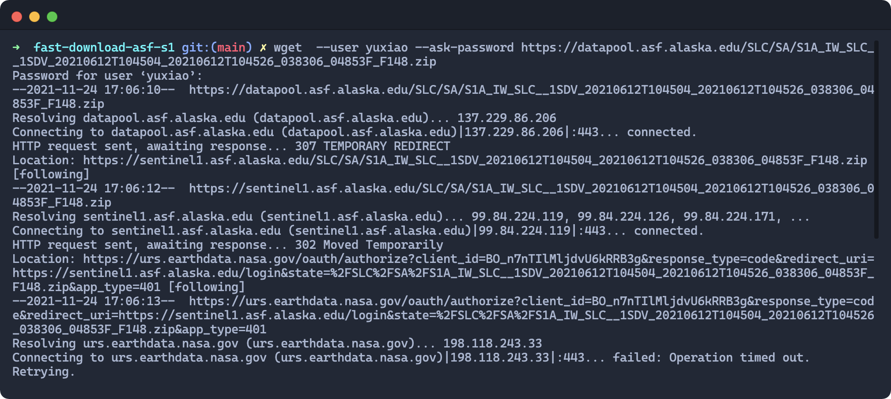
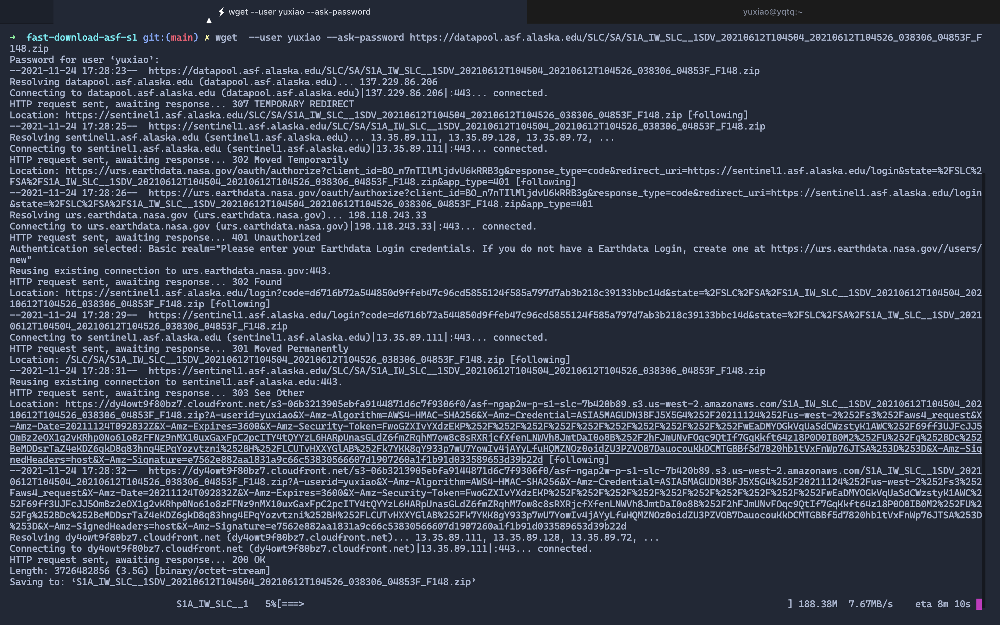
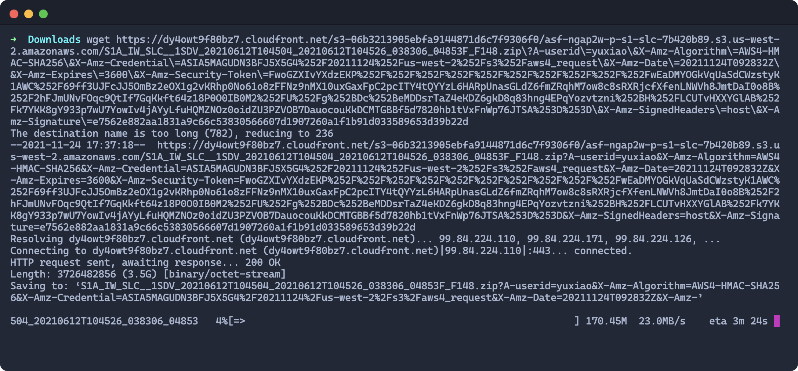

# fast-download-asf-s1

This repo provides a solution to download S1 from ASF link at a rather high speed.
Since this solution is mostly a concern for Chinese scholars and researchers,
the following paragraphs are written in Chinese.

## 从 ASF 网站高速下载 Sentinel-1 数据

此 repo 描述了一种可以解决无法从 ASF 网站下载 Sentinel-1 数据的问题，且新的下载数据可以达到相当快的速度（本人在教育网与华为云服务器上皆测试单景达到了 20MB/s 的速度）。

## 问题描述

貌似从最近（大约从 2021 年？）开始，目前如果使用 ASF 网站下载 Sentinel-1 数据，会出现以下问题：


*卡在连接 urs.earthdata.nasa.gov 上*

也就是无法连接 urs.earthdata.nasa.gov。(有一个很诡异的点，因为 urs.earthdata.nasa.gov的 80 端口是可以访问的，但是 443 端口和 ping 都是不通的。我感觉更像是近期 nasa.gov 在某些端口 block 了来自中国的用户？求解。)

我一开始一直以为数据是在 urs.earthdata.nasa.gov 存储的，那就意味着 ASF 下载数据是死路一条了。然而通过进一步研究发现，其实 urs.earthdata.nasa.gov 也只是一个中转跳板，最终的数据其实是在 AWS cloudfront 这个著名的 CDN 上存储的：


*最终的下载连接其实是一个 AWS CDN*

一个很有意思的事情是，AWS cloudfront 的 CDN 其实是可以正常访问的。作为一个著名的 CDN，其线路其实是非常优化的，我尝试了华为云服务器（北京）、教育网（西安）、电信 5G（西安）等，都达到了非常理想的下载速度，其中前二者都可以达到 20MB/s 的速度。那么接下来问题就变得简单了：只要能从原始的 ASF 的 link 解析到最终的 AWS cloudfront 的 URL，就可以在国内环境下实现一个非常理想的下载速度。


*在教育网测到了 20MB/s+ 的下载速度*

## 如何使用该脚本加速？

**第一步**，解析真实的下载链接。

```bash
# filelist 里面存储的是所有原始链接，每一行一个链接。这些链接可以直接从 ASF 中下载得到。
bash resolve_download_url.sh filelist
```

该脚本将依次执行 `wget` 命令，获取真实的数据下载链接。最后将所有解析的真实链接存到一个名为
`resolved_url` 的文件中。注：该步骤需要在可以解析 `urs.earthdata.nasa.gov` 的环境下进行。因为不会进行真实的数据下载，所以整个过程较快。根据你网络的情况，通常解析每一个链接只需要 10 秒以内。


**第二步**，下载数据。

得到解析的链接之后，就可以在国内的网络环境下高速下载 Sentinel-1 数据了：

```bash
# 在服务器上的 background 任务中下载
bash download_resolved_on_server.sh resolved_url
```

问：为什么该脚本会在 background 任务中同时下载所有的链接？

答：上面解析的链接其实是有时效的，通常是一个小时后过期。所以如果影像数量较多，一景一景下载，一个小时后还没有开始的链接就会失效。所以该脚本会在 background 任务中同时 trigger 所有的下载链接。https 应该是有最大连接数的，作者目前测试同时在 background 中运行 50 个 wget下载任务是没有任何问题的。

## FAQ

问：为什么不能「科学上网」后直接下载呢？这样不是更省事吗？

答：首先，服务器不能科学上网；其次，科学上网/代理速度总会慢一些，很难达到 20MB/s 的速度。第三，我希望给出一个更为 generic 的解决方案。
